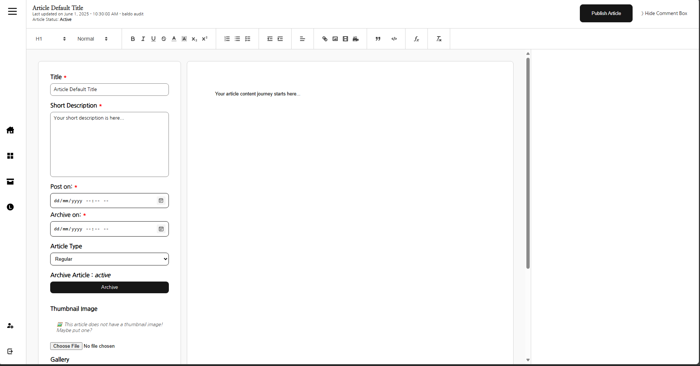
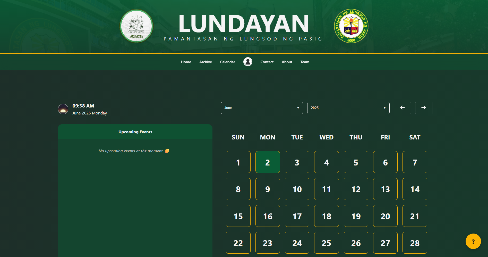
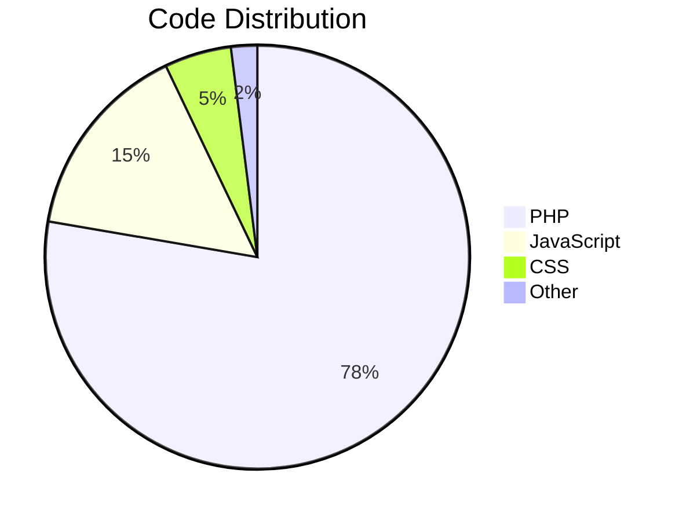

<div align="center">
  
</div>

<h1 align="center" style="border-bottom: none; margin-top: 20px;">🌐 G16-CMS</h1>
<h3 align="center" style="font-weight: 300;">Next-Gen Content Management for PLP MIS Department</h3>

<div align="center">

[](https://php.net/)
[](https://developer.mozilla.org/en-US/docs/Web/HTML)
[](https://developer.mozilla.org/en-US/docs/Web/CSS)
[](https://developer.mozilla.org/en-US/docs/Web/JavaScript)
[](https://github.com/klarrrr/g16-cms/commits)

</div>

---

## ✨ Key Features

<div align="center">

<table>
  <tr>
    <td width="33%" valign="top">
      📝 <strong>Inline Content Editing</strong><br>
      <sub>Real-time WYSIWYG editing with instant previews</sub>
    </td>
    <td width="33%" valign="top">
      🗓️ <strong>Smart Event Calendar</strong><br>
      <sub>Auto-highlighting for upcoming events + Google Maps integration</sub>
    </td>
    <td width="33%" valign="top">
      👨‍💻 <strong>Role-Based Access</strong><br>
      <sub>Admin, Editor, and Reviewer roles with granular permissions</sub>
    </td>
  </tr>
  <tr>
    <td width="33%" valign="top">
      📊 <strong>Audit Logs</strong><br>
      <sub>Track every change with timestamps and user attribution</sub>
    </td>
    <td width="33%" valign="top">
      📱 <strong>Mobile-Optimized</strong><br>
      <sub>Fully responsive design for all devices</sub>
    </td>
    <td width="33%" valign="top">
      🔒 <strong>Secure Authentication</strong><br>
      <sub>Form validation + CSRF protection</sub>
    </td>
  </tr>
</table>

</div>

---

## ‼️ Quick Reminder

The current files in this repository might now work due to modified files. 
Files are modified to fit the needs of a hosting website called "Infinity Free".
If you guys want to view the actual website you can go and visit it here:

[https://lundayan-plp.great-site.net](https://lundayan-plp.great-site.net)

---

---

## 🚀 Quick Start

```bash
# Clone the repository
git clone https://github.com/klarrrr/g16-cms.git

# Navigate to project
cd g16-cms

# Set up environment (XAMPP/Laragon/WAMP)
cp config.sample.php config.php
```

**Requirements:**
- PHP 8.2+
- MySQL 5.7+
- Apache/Nginx

---

## 🖥️ Screenshots

<div align="center" style="margin: 32px 0;">

| Home Page | Article Editor | Calendar |
|-----------|----------------|----------|
|  |  |  |

</div>

---

## 🛠 Tech Stack

<div align="center">



</div>

**Core Technologies:**
- Frontend: Vanilla JS
- Backend: Custom PHP MVC
- Database: MySQL
- Security: Prepared Statements, CSRF Tokens

---

## 🤝 Contribute

We welcome contributions! Here's how:

1. Fork the project
2. Create your feature branch (`git checkout -b feature/SampleFeature`)
3. Commit your changes (`git commit -m 'Add some SampleFeature'`)
4. Push to the branch (`git push origin feature/SampleFeature`)
5. Open a Pull Request

---

## 📬 Contact

<div align="center" style="margin-top: 40px;">

[](mailto:Lundayan.StudentPublication@gmail.com)

</div>

---

<div align="center" style="margin-top: 60px;">
✨ Nice try Diddy ✨
</div>
